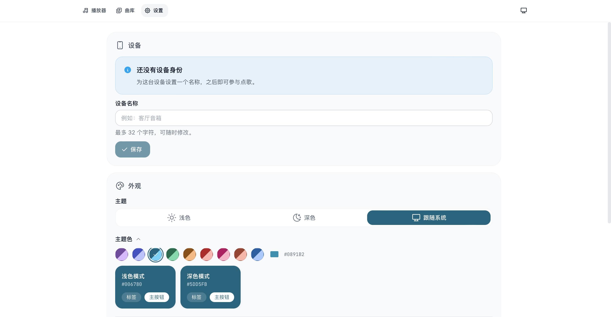

<div align="center">

# Rakuraku Music Station NG

**把一台普通服务器变成大家都能点歌的社区电台。**

Rust 音频引擎、Web 后端与 React 前端打包在同一个服务里：一个端口即可提供网页、实时状态、同步歌词和连续 MP3 音频流。

[](LICENSE)


[在线体验](https://music.risnordev.org) · [快速安装](#快速开始) · [技术文档](docs/TECHNICAL.md) · [参与开发](docs/TECHNICAL.md#开发与验证)

</div>


> 在线实例由社区运营，当前曲目与服务状态会随时间变化。仓库截图来自本地演示实例，不包含线上访客或管理员数据。

## 它能做什么

- **连续电台流**：`ffmpeg` 解码后写入共享环形缓冲，所有听众从 `/stream` 收听同一条实时 MP3 流。
- **多人点歌**：浏览曲库即可加入队列；请求歌曲优先于目录轮播，管理员可以调整顺序、移除或切歌。
- **实时同步**：WebSocket 每 500 ms 推送播放状态，浏览器平滑计算进度；断线时自动降级为 REST 轮询。
- **同步歌词与封面**：扫描同名 `.lrc`、旁路封面或音频内嵌封面；切歌时发送完整歌词，后续只发送当前行。
- **智能元数据补全**：优先读取本地标签；管理员还可匿名匹配网易云候选，为缺少专辑或封面的歌曲补全信息。
- **免注册设备身份**：浏览器通过 httpOnly Cookie 获得设备身份，可改名、收藏和点歌；管理员使用部署令牌提权。
- **完整管理面板**：歌曲扫描与上传、用户管理、播放历史、批量下载、网易云导入和电台品牌设置集中在设置页。
- **适合自托管**：单 Rust 二进制、SQLite、单端口；支持反向代理、HTTPS、子路径部署和 PWA。

## 界面一览

播放器以当前曲目为中心：桌面端同时显示歌词与队列，移动端用滑动分页在播放器和队列之间切换。底部迷你播放器在所有页面保持可用。

深色主题保留相同的信息密度与操作路径，可在设置中手动选择，也可以跟随系统外观自动切换。


设置页集中管理设备身份、个性化外观和管理员功能。主题支持浅色、深色和跟随系统，种子色会生成相应的整套界面配色。



### 元数据是怎样补全的

1. 入库时用 `ffprobe` 读取音频内的标题、艺术家、专辑和时长；缺失标题或艺术家时从文件名回退解析。
2. 自动发现同名 `.lrc`、旁路图片和音频内嵌封面，并预热封面缓存。
3. 管理员点击“补全元数据”后，后端匿名搜索网易云，仅处理缺少专辑或封面的曲目。
4. 标题、艺术家和时长达到可信阈值后才写入匹配结果；远程封面只接受受信任的 HTTPS 域名，并限制为 10 MB。

补全不会覆盖已有标题、艺术家或专辑。匹配来源与时间会写入 SQLite，避免重复查询。

## 快速开始

### 一行安装到 Linux

适用于带 `systemd` 的 Debian/Ubuntu、Arch Linux 和 Fedora。脚本安装构建与运行依赖、创建独立用户，并启用 `rakuraku-music-station` 服务。

```bash
curl -fsSL https://raw.githubusercontent.com/Risaly-Noroki-Dev-Club/Rakurakumusicstation-NG/main/install.sh | sudo bash
```

安装完成后：

```bash
# 首先修改管理员令牌和电台配置
sudoedit /etc/rakuraku/config.toml

# 放入音乐并重启；随后在网页管理面板执行“重新扫描”
sudo cp /path/to/music/* /var/lib/rakuraku/media/
sudo systemctl restart rakuraku-music-station

# 查看运行日志
journalctl -u rakuraku-music-station -f
```

默认访问地址为 `http://服务器地址:2241`。可通过 `RAKURAKU_PORT`、`RAKURAKU_REF`、`RAKURAKU_INSTALL_DIR`、`RAKURAKU_DATA_DIR` 等环境变量调整安装位置和版本。

### 从源码构建

需要 Rust toolchain、Node.js/npm、`ffmpeg` 和 `ffprobe`。

```bash
git clone https://github.com/Risaly-Noroki-Dev-Club/Rakurakumusicstation-NG.git
cd Rakurakumusicstation-NG

# 类型检查并构建 React 前端，然后构建 Rust release 二进制和 dist/
./build_release.sh

# 首次使用前修改 admin_setup_token
$EDITOR dist/config.toml

# 放入音乐并启动
cp /path/to/music/* dist/media/
cd dist
./start.sh
```

停止服务：

```bash
cd dist && ./stop.sh
```

`build_release.sh` 会保留已有的 `dist/media/`、`dist/data/` 和 `dist/config.toml`，因此重复构建不会覆盖音乐、数据库或配置。已确认静态资源是最新版本时可传入 `--skip-frontend`。

## 第一次使用

1. 打开 `http://localhost:2241`。浏览器会自动获得设备 Cookie，无需注册账号。
2. 进入“设置”，在设备区域输入 `config.toml` 中的 `admin_setup_token` 获取管理员权限。
3. 进入“设置 → 电台管理 → 歌曲”，执行“重新扫描”。
4. 可选：执行“补全元数据”，为缺少专辑或封面的歌曲寻找可靠匹配。
5. 回到曲库点歌。VLC、mpv 或 ffplay 也可直接打开 `http://localhost:2241/stream`。

支持 MP3、FLAC、WAV、OGG、M4A 和 AAC。歌词文件应与音频同名，例如：

```text
Music/
├── Artist - Song.flac
├── Artist - Song.lrc
└── cover.jpg
```

## 页面与管理

| 页面 | 路径 | 内容 |
| --- | --- | --- |
| 播放器 | `/`、`/player` | 封面、同步歌词、在线听众、点歌队列和实时进度 |
| 曲库 | `/library` | 搜索、点歌、本地收藏、封面与歌曲标签 |
| 设置 | `/settings` | 设备名称、管理员提权、主题、通知和个人网易云账号 |

管理员会在设置页额外看到“电台管理”：

| 分区 | 能力 |
| --- | --- |
| 概览 | 统计、管理日志和播放历史 |
| 歌曲 | 上传、试听、删除、重新扫描、补全元数据 |
| 用户 | 设备列表、封禁/解封、提权/降权 |
| 下载 | 网易云、网盘与 Spotify 链接批量任务及进度 |
| 网易云 | 全局 Cookie、登录测试、歌单或单曲导入 |
| 电台设置 | 名称、短名称、副标题、简介和站点图标 |

## 技术文档

架构、完整配置、反向代理、子路径部署、API、开发命令和故障排查已整理到独立的 [技术文档](docs/TECHNICAL.md)，便于部署者和贡献者集中查阅。

## License 与致谢

本项目以 [MIT License](LICENSE) 发布。

网易云相关实现参考 [Music163bot-Go](https://github.com/XiaoMengXinX/Music163bot-Go) 的 API 与 Eapi 思路，并在 Rust 中重写。感谢 [FFmpeg](https://ffmpeg.org/)、[Axum](https://github.com/tokio-rs/axum)、[React](https://react.dev/)、[Appica UI](https://appica.dev/)、[Vite](https://vite.dev/)、[Material Color Utilities](https://github.com/material-foundation/material-color-utilities) 与 [SQLx](https://github.com/launchbadge/sqlx)。

灵感来源：《孤独摇滚！》中的伊地知虹夏。

### 人生致谢

Chinese Football 在《Win&Lose》的封底写过：

> 每个人都想成为赢家，想让自己付出的时间得到胜利的喜悦作为回报。
>
> 日复一日，我开始接受自己是一个失败者，也开始接受有些梦想注定会失败这个事实。我学会安慰自己：你拥有的是过程，至少你尝试过，收获在别处，你已经赢下了与自己的战斗。
>
> 那么就祝贺自己还算清醒吧。我没有在与他人竞争之后迷失于虚荣，也没有在与自己竞争之后沉溺于情绪。
