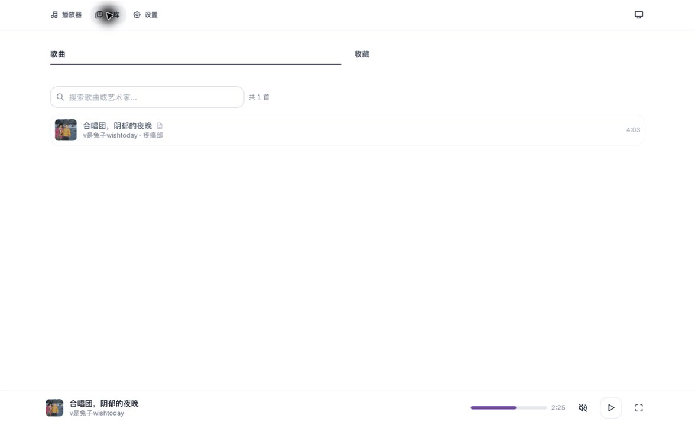
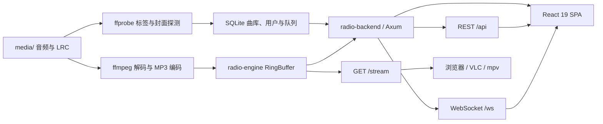

<div align="center">

# Rakuraku Music Station NG

**把一台普通服务器变成大家都能点歌的社区电台。**

Rust 音频引擎、Web 后端与 React 前端打包在同一个服务里：一个端口即可提供网页、实时状态、同步歌词和连续 MP3 音频流。

[](LICENSE)


[在线体验](https://music.risnordev.org) · [快速安装](#快速开始) · [部署配置](#配置与部署) · [参与开发](#开发与验证)

</div>


> 在线实例由社区运营，当前曲目与服务状态会随时间变化。仓库截图来自本地演示实例，不包含线上访客或管理员数据。

## 它能做什么

- **连续电台流**：`ffmpeg` 解码后写入共享环形缓冲，所有听众从 `/stream` 收听同一条实时 MP3 流。
- **多人点歌**：浏览曲库即可加入队列；请求歌曲优先于目录轮播，管理员可以调整顺序、移除或切歌。
- **实时同步**：WebSocket 每 500 ms 推送播放状态，浏览器平滑计算进度；断线时自动降级为 REST 轮询。
- **同步歌词与封面**：扫描同名 `.lrc`、旁路封面或音频内嵌封面；切歌时发送完整歌词，后续只发送当前行。
- **智能元数据补全**：优先读取本地标签；管理员还可匿名匹配网易云候选，为缺少专辑或封面的歌曲补全信息。
- **免注册设备身份**：浏览器通过 httpOnly Cookie 获得设备身份，可改名、收藏和点歌；管理员使用部署令牌提权。
- **完整管理面板**：歌曲扫描与上传、用户管理、播放历史、批量下载、网易云导入和电台品牌设置集中在设置页。
- **适合自托管**：单 Rust 二进制、SQLite、单端口；支持反向代理、HTTPS、子路径部署和 PWA。

## 界面一览

播放器以当前曲目为中心：桌面端同时显示歌词与队列，移动端用滑动分页在播放器和队列之间切换。底部迷你播放器在所有页面保持可用。

曲库会展示从标签读取的标题、艺术家、专辑和时长，也可以搜索、点歌或保存到浏览器本地收藏。



### 元数据是怎样补全的

1. 入库时用 `ffprobe` 读取音频内的标题、艺术家、专辑和时长；缺失标题或艺术家时从文件名回退解析。
2. 自动发现同名 `.lrc`、旁路图片和音频内嵌封面，并预热封面缓存。
3. 管理员点击“补全元数据”后，后端匿名搜索网易云，仅处理缺少专辑或封面的曲目。
4. 标题、艺术家和时长达到可信阈值后才写入匹配结果；远程封面只接受受信任的 HTTPS 域名，并限制为 10 MB。

补全不会覆盖已有标题、艺术家或专辑。匹配来源与时间会写入 SQLite，避免重复查询。

## 快速开始

### 一行安装到 Linux

适用于带 `systemd` 的 Debian/Ubuntu、Arch Linux 和 Fedora。脚本安装构建与运行依赖、创建独立用户，并启用 `rakuraku-music-station` 服务。

```bash
curl -fsSL https://raw.githubusercontent.com/Risaly-Noroki-Dev-Club/Rakurakumusicstation-NG/main/install.sh | sudo bash
```

安装完成后：

```bash
# 首先修改管理员令牌和电台配置
sudoedit /etc/rakuraku/config.toml

# 放入音乐并重启；随后在网页管理面板执行“重新扫描”
sudo cp /path/to/music/* /var/lib/rakuraku/media/
sudo systemctl restart rakuraku-music-station

# 查看运行日志
journalctl -u rakuraku-music-station -f
```

默认访问地址为 `http://服务器地址:2241`。可通过 `RAKURAKU_PORT`、`RAKURAKU_REF`、`RAKURAKU_INSTALL_DIR`、`RAKURAKU_DATA_DIR` 等环境变量调整安装位置和版本。

### 从源码构建

需要 Rust toolchain、Node.js/npm、`ffmpeg` 和 `ffprobe`。

```bash
git clone https://github.com/Risaly-Noroki-Dev-Club/Rakurakumusicstation-NG.git
cd Rakurakumusicstation-NG

# 类型检查并构建 React 前端，然后构建 Rust release 二进制和 dist/
./build_release.sh

# 首次使用前修改 admin_setup_token
$EDITOR dist/config.toml

# 放入音乐并启动
cp /path/to/music/* dist/media/
cd dist
./start.sh
```

停止服务：

```bash
cd dist && ./stop.sh
```

`build_release.sh` 会保留已有的 `dist/media/`、`dist/data/` 和 `dist/config.toml`，因此重复构建不会覆盖音乐、数据库或配置。已确认静态资源是最新版本时可传入 `--skip-frontend`。

## 第一次使用

1. 打开 `http://localhost:2241`。浏览器会自动获得设备 Cookie，无需注册账号。
2. 进入“设置”，在设备区域输入 `config.toml` 中的 `admin_setup_token` 获取管理员权限。
3. 进入“设置 → 电台管理 → 歌曲”，执行“重新扫描”。
4. 可选：执行“补全元数据”，为缺少专辑或封面的歌曲寻找可靠匹配。
5. 回到曲库点歌。VLC、mpv 或 ffplay 也可直接打开 `http://localhost:2241/stream`。

支持 MP3、FLAC、WAV、OGG、M4A 和 AAC。歌词文件应与音频同名，例如：

```text
Music/
├── Artist - Song.flac
├── Artist - Song.lrc
└── cover.jpg
```

## 页面与管理

| 页面 | 路径 | 内容 |
| --- | --- | --- |
| 播放器 | `/`、`/player` | 封面、同步歌词、在线听众、点歌队列和实时进度 |
| 曲库 | `/library` | 搜索、点歌、本地收藏、封面与歌曲标签 |
| 设置 | `/settings` | 设备名称、管理员提权、主题、通知和个人网易云账号 |

管理员会在设置页额外看到“电台管理”：

| 分区 | 能力 |
| --- | --- |
| 概览 | 统计、管理日志和播放历史 |
| 歌曲 | 上传、试听、删除、重新扫描、补全元数据 |
| 用户 | 设备列表、封禁/解封、提权/降权 |
| 下载 | 网易云、网盘与 Spotify 链接批量任务及进度 |
| 网易云 | 全局 Cookie、登录测试、歌单或单曲导入 |
| 电台设置 | 名称、短名称、副标题、简介和站点图标 |

主题支持浅色、深色和跟随系统；种子色通过 Material Color Utilities 生成对应的浅色与深色配色。

## 架构



运行时只有一个服务进程：

| 组件 | 技术 | 职责 |
| --- | --- | --- |
| `radio-engine` | Rust、Tokio、ffmpeg | 播放循环、编码、环形缓冲和多客户端音频流 |
| `radio-backend` | Axum 0.7、SQLx、SQLite | REST、WebSocket、设备认证、队列、管理和静态文件 |
| `radio-backend/frontend` | React 19、TypeScript、Appica UI、zustand、Vite | 播放器、曲库、设置、管理面板和 PWA |

后端、引擎之间没有 Redis、HTTP IPC 或第二个音频进程。前端生产产物写入 `radio-backend/static/`，由同一个后端二进制提供。

## 配置与部署

配置默认从当前工作目录的 `config.toml` 读取，也可用 `RADIO_CONFIG` 指向其他文件。完整示例见 [`radio-backend/config.toml.example`](radio-backend/config.toml.example)。

```toml
[server]
host = "0.0.0.0"
port = 2241
base_path = "/"

[database]
url = "sqlite://data/radio.db?mode=rwc"

[audio_engine]
media_path = "./media"
stream_base = "auto"

[device]
admin_setup_token = "请替换为随机且私密的值"
```

重要环境变量：`RADIO_DATABASE_URL`、`RADIO_SERVER_PORT`、`RADIO_BASE_PATH`、`RADIO_MEDIA_PATH`、`RADIO_STREAM_BASE`、`RADIO_STATION_NAME`、`RADIO_ADMIN_SETUP_TOKEN` 和 `RADIO_LOG_LEVEL`。

保存管理设置会写回 `config.toml`，但不会热重载；修改后需重启服务。

### 反向代理

推荐保持 `stream_base = "auto"`，并向后端传递 `Host`、`X-Forwarded-Host`、`X-Forwarded-Proto` 和 `X-Forwarded-Port`。后端会据此生成正确的 `/stream` 与 `/ws` 地址，HTTPS 会自动对应 WSS。

### 子路径部署

例如部署到 `https://example.com/radio/`：

```toml
[server]
base_path = "/radio"
```

```bash
cd radio-backend/frontend
VITE_BASE_PATH=/radio/ npm run build
```

反向代理应保留 `/radio` 前缀。后端会在该前缀下提供 SPA、API、WebSocket、音频流和 manifest。

## API 速览

| 接口 | 认证 | 说明 |
| --- | --- | --- |
| `GET /api/station` | 公开 | 电台名称、图标、流和 WebSocket 地址 |
| `GET /api/now-playing` | 公开 | 当前歌曲快照与播放位置 |
| `GET /api/songs` | 公开 | 曲库搜索与分页 |
| `GET /api/songs/:id/cover` | 公开 | 本地、内嵌或补全后的封面 |
| `GET /api/queue` | 公开 | 当前点歌队列；普通访客看到脱敏点歌人 |
| `POST /api/queue` | 设备 | 点歌 |
| `POST /api/admin/rescan-songs` | 管理员 | 扫描媒体目录并重载引擎队列 |
| `POST /api/admin/enrich-song-metadata` | 管理员 | 补全缺失专辑或封面 |
| `WS /ws` | Cookie | 播放状态、歌词、队列、通知和听众列表 |
| `GET /stream` | 公开 | 连续 `audio/mpeg` 电台流 |

所有 JSON API 使用 `{ "success": bool, "data": ..., "error": ... }` 包装。

## 开发与验证

```bash
# 后端 debug 构建
cd radio-backend && cargo build

# 后端测试（含元数据匹配、歌词、NCM 解析和清理逻辑）
cd radio-backend && cargo test

# 音频引擎环形缓冲测试
cd radio-engine && cargo test ring_buffer

# 前端开发服务器，代理到 localhost:2241
cd radio-backend/frontend && npm run dev

# TypeScript 检查 + Vite 生产构建
cd radio-backend/frontend && npm run build
```

Vite 默认监听 `5173`，可用 `VITE_PROXY_TARGET` 指向另一个后端。提交前至少应通过前端构建、后端测试和引擎 ring buffer 测试。

## 常见问题

| 现象 | 排查 |
| --- | --- |
| 页面能开但没有声音 | 检查 `media/`、`ffmpeg`、`/api/now-playing` 和 `/stream`；浏览器首次播放需要用户交互 |
| 曲库没有新文件 | 管理面板执行“重新扫描”，并确认 `ffprobe` 可用且 `media_path` 正确 |
| 歌词不显示 | `.lrc` 与音频必须同名；UTF-8、UTF-16 和常见中文 GBK 编码均可读取 |
| 封面不显示 | 使用音频内嵌封面、同名图片或 `cover.jpg/png`；也可执行元数据补全 |
| 反代后 WebSocket 或流地址错误 | 传递 `Host` 与 `X-Forwarded-*`，或显式设置 `stream_base` |
| 管理员设置不生效 | 确认 `admin_setup_token` 不为空且不是公开默认值；保存配置后重启服务 |
| 本机流连接测试行为异常 | 用 `curl --noproxy '*'` 绕过 shell 代理变量 |

## License 与致谢

本项目以 [MIT License](LICENSE) 发布。

网易云相关实现参考 [Music163bot-Go](https://github.com/XiaoMengXinX/Music163bot-Go) 的 API 与 Eapi 思路，并在 Rust 中重写。感谢 [FFmpeg](https://ffmpeg.org/)、[Axum](https://github.com/tokio-rs/axum)、[React](https://react.dev/)、[Appica UI](https://appica.dev/)、[Vite](https://vite.dev/)、[Material Color Utilities](https://github.com/material-foundation/material-color-utilities) 与 [SQLx](https://github.com/launchbadge/sqlx)。

灵感来源：《孤独摇滚！》中的伊地知虹夏。

### 人生致谢

Chinese Football 在《Win&Lose》的封底写过：

> 每个人都想成为赢家，想让自己付出的时间得到胜利的喜悦作为回报。
>
> 日复一日，我开始接受自己是一个失败者，也开始接受有些梦想注定会失败这个事实。我学会安慰自己：你拥有的是过程，至少你尝试过，收获在别处，你已经赢下了与自己的战斗。
>
> 那么就祝贺自己还算清醒吧。我没有在与他人竞争之后迷失于虚荣，也没有在与自己竞争之后沉溺于情绪。
