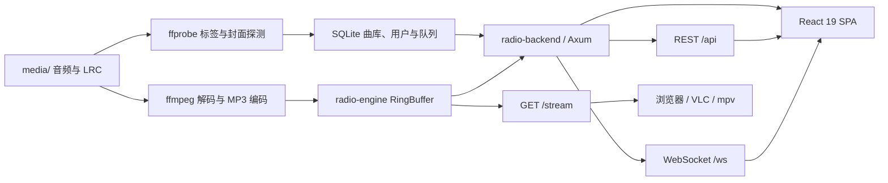

# Rakuraku Music Station NG 技术文档

本文面向部署者与贡献者，集中说明 Rakuraku Music Station NG 的运行架构、配置方式、接口和开发验证流程。产品介绍、界面截图与快速上手请见项目 [README](../README.md)。

## 架构



运行时只有一个服务进程：

| 组件 | 技术 | 职责 |
| --- | --- | --- |
| `radio-engine` | Rust、Tokio、ffmpeg | 播放循环、编码、环形缓冲和多客户端音频流 |
| `radio-backend` | Axum 0.7、SQLx、SQLite | REST、WebSocket、设备认证、队列、管理和静态文件 |
| `radio-backend/frontend` | React 19、TypeScript、Appica UI、zustand、Vite | 播放器、曲库、设置、管理面板和 PWA |

后端、引擎之间没有 Redis、HTTP IPC 或第二个音频进程。前端生产产物写入 `radio-backend/static/`，由同一个后端二进制提供。

## 配置与部署

配置默认从当前工作目录的 `config.toml` 读取，也可用 `RADIO_CONFIG` 指向其他文件。完整示例见 [`radio-backend/config.toml.example`](../radio-backend/config.toml.example)。

```toml
[server]
host = "0.0.0.0"
port = 2241
base_path = "/"

[database]
url = "sqlite://data/radio.db?mode=rwc"

[audio_engine]
media_path = "./media"
stream_base = "auto"

[device]
admin_setup_token = "请替换为随机且私密的值"
```

重要环境变量：`RADIO_DATABASE_URL`、`RADIO_SERVER_PORT`、`RADIO_BASE_PATH`、`RADIO_MEDIA_PATH`、`RADIO_STREAM_BASE`、`RADIO_STATION_NAME`、`RADIO_ADMIN_SETUP_TOKEN` 和 `RADIO_LOG_LEVEL`。

保存管理设置会写回 `config.toml`，但不会热重载；修改后需重启服务。

### 反向代理

推荐保持 `stream_base = "auto"`，并向后端传递 `Host`、`X-Forwarded-Host`、`X-Forwarded-Proto` 和 `X-Forwarded-Port`。后端会据此生成正确的 `/stream` 与 `/ws` 地址，HTTPS 会自动对应 WSS。

### 子路径部署

例如部署到 `https://example.com/radio/`：

```toml
[server]
base_path = "/radio"
```

```bash
cd radio-backend/frontend
VITE_BASE_PATH=/radio/ npm run build
```

反向代理应保留 `/radio` 前缀。后端会在该前缀下提供 SPA、API、WebSocket、音频流和 manifest。

## API 速览

| 接口 | 认证 | 说明 |
| --- | --- | --- |
| `GET /api/station` | 公开 | 电台名称、图标、流和 WebSocket 地址 |
| `GET /api/now-playing` | 公开 | 当前歌曲快照与播放位置 |
| `GET /api/songs` | 公开 | 曲库搜索与分页 |
| `GET /api/songs/:id/cover` | 公开 | 本地、内嵌或补全后的封面 |
| `GET /api/queue` | 公开 | 当前点歌队列；普通访客看到脱敏点歌人 |
| `POST /api/queue` | 设备 | 点歌 |
| `POST /api/admin/rescan-songs` | 管理员 | 扫描媒体目录并重载引擎队列 |
| `POST /api/admin/enrich-song-metadata` | 管理员 | 补全缺失专辑或封面 |
| `WS /ws` | Cookie | 播放状态、歌词、队列、通知和听众列表 |
| `GET /stream` | 公开 | 连续 `audio/mpeg` 电台流 |

所有 JSON API 使用 `{ "success": bool, "data": ..., "error": ... }` 包装。

## 开发与验证

```bash
# 后端 debug 构建
cd radio-backend && cargo build

# 后端测试（含元数据匹配、歌词、NCM 解析和清理逻辑）
cd radio-backend && cargo test

# 音频引擎环形缓冲测试
cd radio-engine && cargo test ring_buffer

# 前端开发服务器，代理到 localhost:2241
cd radio-backend/frontend && npm run dev

# TypeScript 检查 + Vite 生产构建
cd radio-backend/frontend && npm run build
```

Vite 默认监听 `5173`，可用 `VITE_PROXY_TARGET` 指向另一个后端。提交前至少应通过前端构建、后端测试和引擎 ring buffer 测试。

## 常见问题

| 现象 | 排查 |
| --- | --- |
| 页面能开但没有声音 | 检查 `media/`、`ffmpeg`、`/api/now-playing` 和 `/stream`；浏览器首次播放需要用户交互 |
| 曲库没有新文件 | 管理面板执行“重新扫描”，并确认 `ffprobe` 可用且 `media_path` 正确 |
| 歌词不显示 | `.lrc` 与音频必须同名；UTF-8、UTF-16 和常见中文 GBK 编码均可读取 |
| 封面不显示 | 使用音频内嵌封面、同名图片或 `cover.jpg/png`；也可执行元数据补全 |
| 反代后 WebSocket 或流地址错误 | 传递 `Host` 与 `X-Forwarded-*`，或显式设置 `stream_base` |
| 管理员设置不生效 | 确认 `admin_setup_token` 不为空且不是公开默认值；保存配置后重启服务 |
| 本机流连接测试行为异常 | 用 `curl --noproxy '*'` 绕过 shell 代理变量 |
